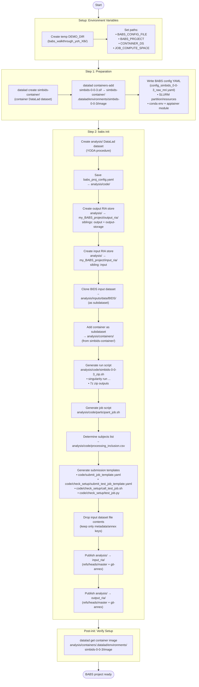

# BABS Init and Submit Diagram


## Workflow Steps



## Resulting Directory Structure

```
DEMO_DIR/  (babs_walkthrough_yoh_X8i/)
├── simbids-container/               ← DataLad dataset (container)
│   └── .datalad/environments/
│       └── simbids-0-0-3/image      ← simbids-0.0.3.sif (annex)
├── config_simbids_0-0-3_raw_mri.yaml
├── job_compute_space/
└── my_BABS_project/                 ← BABS project root
    ├── analysis/                    ← DataLad dataset (YODA), ID: 3348251c-...
    │   ├── code/
    │   │   ├── babs_proj_config.yaml
    │   │   ├── simbids-0-0-3_zip.sh     ← runs container + zips output
    │   │   ├── participant_job.sh        ← SLURM job script
    │   │   ├── processing_inclusion.csv  ← subject/session list
    │   │   ├── submit_job_template.yaml
    │   │   └── check_setup/
    │   │       ├── submit_test_job_template.yaml
    │   │       ├── call_test_job.sh
    │   │       └── test_job.py
    │   ├── inputs/data/              ← subdataset (cloned input BIDS)
    │   ├── containers/               ← subdataset (simbids-container)
    │   └── logs/                     ← SLURM job logs (sim.e/o...)
    ├── input_ria/                    ← RIA store (input sibling)
    │   ├── 334/8251c-0e8a-4b1d-9fb3-af1b16e5b027/  ← analysis dataset (by UUID)
    │   ├── error_logs/
    │   └── ria-layout-version
    └── output_ria/                   ← RIA store (output + output-storage siblings)
        ├── 334/8251c-0e8a-4b1d-9fb3-af1b16e5b027/  ← analysis dataset (by UUID)
        ├── alias/data →              ← symlink to dataset in output_ria
        ├── error_logs/
        └── ria-layout-version
```

## Key DataLad Operations

| Operation | Command | Purpose |
|-----------|---------|---------|
| Create dataset | `datalad create` | Container dataset + analysis dataset |
| Add container | `datalad containers-add` | Register .sif in container dataset |
| Create RIA stores | `datalad create-sibling-ria` | Output RIA (results) + Input RIA (versioning) |
| Clone input data | `datalad install` | BIDS dataset as subdataset of analysis |
| Install container | `datalad install` | Container dataset as subdataset of analysis |
| Drop contents | `datalad drop` | Free disk space, keep annex keys |
| Publish | `datalad publish` | Push analysis branches to both RIA stores |
| Get file | `datalad get` | Retrieve container .sif for test job |
