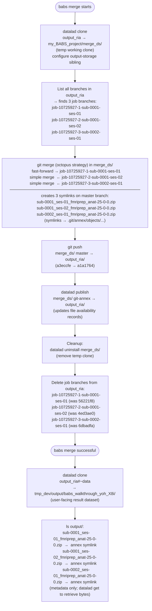

# BABS Merge Workflow Diagram

Based on `merge.txt`: `babs merge` collecting results from 3 completed jobs.

## DataLad/Git Operations



## Git Branch State: Before and After

```
output_ria/  BEFORE babs merge          output_ria/  AFTER babs merge
─────────────────────────────           ───────────────────────────────
master  (a3eccfe)                       master  (a1a1764)  ← octopus merge commit
job-10725927-1-sub-0001-ses-01          (branch deleted)
job-10725927-2-sub-0001-ses-02          (branch deleted)
job-10725927-3-sub-0002-ses-01          (branch deleted)
```

## Data Flow Summary

```
output_ria/
  job branches (3)
       │
       │  clone → merge_ds/  (temp)
       │       │
       │  git octopus merge all job branches → master
       │       │
       │  push master ──────────────────────────────> output_ria/ master (updated)
       │  push git-annex ──────────────────────────> output_ria/ git-annex (updated)
       │       │
       │  uninstall merge_ds/  (cleanup)
       │  delete job branches
       │
       │  datalad clone #~data alias
       └──────────────────────────────────────────> output/babs_walkthrough_yoh_X8i/
                                                    (3 zip symlinks, annex keys only)
```
