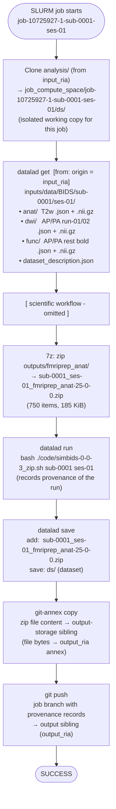

# BABS Submit Workflow Diagram (per-job)

Based on `submit.txt`: single SLURM job for `sub-0001 ses-01` (job ID: 10725927).

## DataLad/Git Operations



## Data Flow Summary

```
input_ria/                          job_compute_space/
(origin)                            job-10725927-1-sub-0001-ses-01/ds/
    │                                       │
    │  ── datalad get (annex) ──────────>   inputs/data/BIDS/sub-0001/ses-01/
    │  ── git clone (metadata) ──────────>  code/, .datalad/, ...
    │                                       │
    │                                  [scientific workflow]
    │                                       │
    │                                  sub-0001_ses-01_fmriprep_anat-25-0-0.zip
    │                                       │
    │                           datalad run + save (provenance commit)
    │                                       │
    │                          ┌────────────┴───────────────┐
    │                          ▼                            ▼
    │                   output_ria/                  output_ria/
    │                   (output-storage)             (output)
    │                   file bytes (annex)           git branch (provenance)
```
